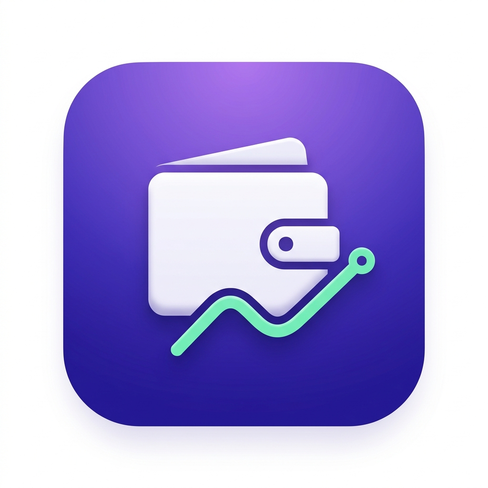
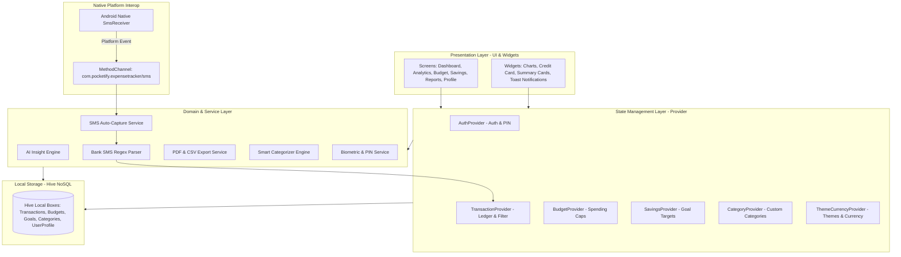

# 💰 Pocketify — Smart AI Expense & Financial Health Tracker

<p align="center">
  
</p>

<p align="center">
  <b>An intelligent, privacy-first, offline-ready personal finance tracker built with Flutter, Hive NoSQL, and Provider.</b>
</p>

<p align="center">
  <a href="https://flutter.dev"></a>
  <a href="https://dart.dev"></a>
  <a href="https://docs.hivedb.dev/"></a>
  <a href="https://pub.dev/packages/provider"></a>
  <a href="#"></a>
  <a href="LICENSE"></a>
</p>

---

## 📖 Overview

**Pocketify** is a next-generation personal expense tracker and financial wellness companion. Engineered with a **privacy-first, 100% offline architecture**, Pocketify ensures that your sensitive financial data never leaves your device. 

From **zero-touch native SMS transaction auto-capture** and **AI-driven spending health insights** to **category-level budget capping**, **milestone-based savings goals**, **virtual credit card utilization monitoring**, and **formatted PDF/CSV reporting**, Pocketify delivers a complete, bank-grade personal finance dashboard wrapped in a sleek glassmorphic UI.

---

## 📑 Table of Contents

- [✨ Key Features](#-key-features)
  - [📊 Smart Dashboard & Net Worth Tracker](#-smart-dashboard--net-worth-tracker)
  - [🤖 AI-Powered Financial Health & Insights Engine](#-ai-powered-financial-health--insights-engine)
  - [📲 Zero-Touch SMS Transaction Auto-Capture (Android Native)](#-zero-touch-sms-transaction-auto-capture-android-native)
  - [💡 Intelligent Auto-Categorization & Smart Heuristics](#-intelligent-auto-categorization--smart-heuristics)
  - [🎯 Category Budget Capping & Overspend Guard](#-category-budget-capping--overspend-guard)
  - [🏆 Milestone-Driven Savings Goals Tracker](#-milestone-driven-savings-goals-tracker)
  - [💳 Virtual Credit Card & Utilization Management](#-virtual-credit-card--utilization-management)
  - [📈 Deep-Dive Visual Analytics & Interactive Charts](#-deep-dive-visual-analytics--interactive-charts)
  - [🗓️ Daily Calendar Financial Ledger & Heatmap](#️-daily-calendar-financial-ledger--heatmap)
  - [📑 Export Engine (Branded PDF Statements & CSV Data)](#-export-engine-branded-pdf-statements--csv-data)
  - [🛡️ Biometric & PIN Security (100% Local Hive Storage)](#️-biometric--pin-security-100-local-hive-storage)
  - [🎨 Glassmorphism Design, Dark/Light Mode & Multi-Currency](#-glassmorphism-design-darklight-mode--multi-currency)
  - [🎙️ Hands-Free Voice Logger & OCR Receipt Scanner](#️-hands-free-voice-logger--ocr-receipt-scanner)
- [🏗️ System Architecture](#️-system-architecture)
- [📁 Project Directory Structure](#-project-directory-structure)
- [🗄️ Hive Data Models & Storage Schema](#️-hive-data-models--storage-schema)
- [🚀 Getting Started & Setup](#-getting-started--setup)
- [📱 Native Android SMS Setup Guide](#-native-android-sms-setup-guide)
- [📦 Build & Release Commands](#-build--release-commands)
- [🧪 Testing & Linting](#-testing--linting)
- [❓ Troubleshooting & FAQ](#-troubleshooting--faq)
- [🗺️ Product Roadmap](#️-product-roadmap)
- [🤝 Contributing & License](#-contributing--license)

---

## ✨ Key Features

### 📊 Smart Dashboard & Net Worth Tracker
- **Real-Time Financial Overview**: Instant summary of total net balance, monthly income, monthly expenses, net savings, and credit liabilities.
- **Dynamic Cashflow Indicator**: Live computation of cashflow health with visual income-to-expense ratio bars.
- **Recent Transactions Feed**: Quick-access transaction feed with smart swipe actions for deletion and inline category tagging.
- **Top Expense Categories Breakdown**: High-level visual preview of top spending channels directly on the home screen.

### 🤖 AI-Powered Financial Health & Insights Engine
- **Financial Health Score (0–100)**: Evaluates savings rate, budget adherence, debt-to-income ratio, emergency buffer, and spending consistency.
- **Automated Subscription & Recurring Expense Detection**: Identifies recurring monthly bills (Netflix, Spotify, AWS, Gym, broadband) and forecasts recurring cash outflows.
- **Spending Spike & Anomaly Alerts**: Flags anomalous spending spikes that exceed historical standard deviations for any category.
- **Predictive Month-End Burn Rate**: Projects expected end-of-month expenditure based on current daily spending velocity.
- **Actionable Financial Recommendations**: Contextual advisory cards with one-tap deep links to adjust budgets or contribute to savings.

### 📲 Zero-Touch SMS Transaction Auto-Capture (Android Native)
- **Real-Time Broadcast Interception**: Custom Kotlin `SmsReceiver` listening on `com.pocketify.expensetracker/sms` platform channel.
- **Comprehensive Bank & UPI Regex Engine**: Supports major Indian banks and payment gateways (HDFC, SBI, ICICI, Axis, PNB, Kotak, Bank of Baroda, Paytm, PhonePe, Google Pay, CRED, Amazon Pay, etc.).
- **Smart Entity Parsing**: Automatically extracts transaction amount, type (Debit vs. Credit), merchant/payee name, timestamp, last 4 digits of card/account, and payment mode.
- **Spam & OTP Guard**: Robust multi-stage regex rules filter out OTPs, promotional alerts, balance inquiries, and marketing messages.
- **SMS Audit Log**: Dedicated SMS log screen with transaction status and retry capabilities.

### 💡 Intelligent Auto-Categorization & Smart Heuristics
- **Keyword & Merchant Mapping**: Assigns transactions into pre-configured categories (Food & Dining, Groceries, Shopping, Utilities, Travel, Healthcare, Entertainment, Subscriptions, Salary, Investment, etc.).
- **Adaptive Memory**: Learns from manual category changes made by the user to improve future categorizations.

### 🎯 Category Budget Capping & Overspend Guard
- **Monthly Category Limits**: Define spending ceilings per category with custom time ranges.
- **Color-Coded Progress Rings**: Visual indicators transition smoothly from Emerald Green (<70%) to Amber Yellow (70-90%) and Crimson Red (>90%).
- **Automated Push Warnings**: Local push notifications (`flutter_local_notifications`) trigger at 80%, 90%, and 100% budget thresholds.
- **Budget Performance Analytics**: View historical budget compliance rates month over month.

### 🏆 Milestone-Driven Savings Goals Tracker
- **Custom Goal Creation**: Create dedicated targets for emergency funds, vacations, tech gadgets, vehicles, or debt payoffs.
- **Contribution History**: Deposit and withdraw funds with timestamps and optional transaction notes.
- **Visual Progress & Countdown**: Live progress percentages, remaining amount calculations, and target date countdown timers.
- **Celebration Animations**: Animated milestone badges upon completing savings goals.

### 💳 Virtual Credit Card & Utilization Management
- **Credit Card Limit Tracking**: Manage multiple virtual credit cards, track total credit limits, current billing period spend, and available credit.
- **Utilization Health Meter**: Visual warnings when credit utilization exceeds the recommended 30% financial threshold.
- **Account Linking via SMS**: Matches incoming SMS debit alerts with registered credit cards using card ending digits.

### 📈 Deep-Dive Visual Analytics & Interactive Charts
- **Interactive Charting Engine (`fl_chart`)**:
  - **Spending Timeline Line Charts**: Smooth Bezier curves depicting daily spending trajectories.
  - **Income vs. Expense Bar Comparisons**: Side-by-side monthly comparisons.
  - **Category Donut / Pie Breakdown**: Interactive touch-to-highlight category distribution.
- **Flexible Time Period Filtering**: Switch between This Month, Last Month, Last 30 Days, Last 90 Days, This Year, or Custom Date Ranges.
- **Granular Metrics**: Average transaction size, highest spend day, top recipient, and daily burn rate.

### 🗓️ Daily Calendar Financial Ledger & Heatmap
- **Interactive Calendar Grid**: Day-by-day financial log with color-coded income and expense markers.
- **Daily Drill-Down Modal**: Tap any day to inspect the full list of transactions for that specific date.

### 📑 Export Engine (Branded PDF Statements & CSV Data)
- **Branded PDF Statement Generator**: Generates formatted financial statements with summary metrics, category breakdowns, and transaction tables (`pdf`, `printing`).
- **CSV Data Exporter**: One-tap CSV export compatible with Microsoft Excel, Google Sheets, QuickBooks, and tax software (`csv`).
- **Interactive Monthly Report Modal**: In-app digital report viewer featuring monthly KPIs, category breakdowns, and compliance scores.

### 🛡️ Biometric & PIN Security (100% Local Hive Storage)
- **100% Local Storage**: Powered by **Hive NoSQL** key-value storage. Zero external server dependencies; zero cloud telemetry.
- **Biometric Authentication**: Supports Fingerprint scanner and Face ID (`local_auth`).
- **Cryptographic PIN Lock**: SHA-256 encrypted 4-digit PIN authentication fallback.
- **Multi-Profile Support**: Multiple local user accounts with profile pictures, avatars, and isolated financial databases.

### 🎨 Glassmorphism Design, Dark/Light Mode & Multi-Currency
- **Modern Aesthetics**: Curated dark glassmorphism theme (`#6C5CE7` primary brand glow) with contrast-tested light mode.
- **Global Currency Support**: Seamlessly switch between `₹` (INR), `$` (USD), `€` (EUR), `£` (GBP), `¥` (JPY), `A$` (AUD), `C$` (CAD), and custom currencies.
- **Custom Category Studio**: Create and edit categories with custom names, dynamic Flutter icon pickers, and color swatches.

### 🎙️ Hands-Free Voice Logger & OCR Receipt Scanner
- **Voice Expense Dictation**: Dictate transactions via speech input (`voice_service.dart`).
- **Receipt OCR Text Extraction**: Parse vendor, amount, and date directly from camera photos or receipt images (`ocr_service.dart`).

---

## 🏗️ System Architecture



---

## 📁 Project Directory Structure

```text
expense_tracker/
├── android/                             # Android native configuration & Kotlin SmsReceiver
│   └── app/src/main/
│       ├── AndroidManifest.xml          # SMS permissions & notification channels
│       └── kotlin/com/pocketify/        # Native background SMS listener implementation
├── assets/
│   └── images/
│       ├── app_icon.png                 # Primary application icon
│       └── .gitkeep
├── lib/
│   ├── main.dart                        # Application root, Hive bootstrap, Provider tree
│   ├── models/                          # Hive data models & TypeAdapters
│   │   ├── budget_model.dart            # Category budget limit entity (TypeId: 1)
│   │   ├── category_model.dart          # Transaction category entity (TypeId: 3)
│   │   ├── savings_goal_model.dart      # Savings target & contribution entity (TypeId: 2)
│   │   ├── transaction_model.dart       # Transaction entity & enums (TypeId: 0)
│   │   └── user_profile_model.dart      # User profile, PIN & preferences (TypeId: 4)
│   ├── providers/                       # ChangeNotifier business state providers
│   │   ├── auth_provider.dart           # Authentication & PIN security state
│   │   ├── budget_provider.dart         # Budget calculation & overspend tracking
│   │   ├── category_provider.dart       # Dynamic category state management
│   │   ├── savings_provider.dart        # Savings goals & contribution history
│   │   ├── theme_currency_provider.dart # Dark/Light theme & currency selection
│   │   └── transaction_provider.dart    # Transaction CRUD, filtering & aggregation
│   ├── screens/                         # Application UI screens
│   │   ├── analytics/
│   │   │   └── analytics_screen.dart    # Charts, trends, and deep-dive spending analytics
│   │   ├── authentication/
│   │   │   ├── login_screen.dart        # PIN / Biometric login screen
│   │   │   └── register_screen.dart     # New profile registration screen
│   │   ├── budget/
│   │   │   └── budget_screen.dart       # Budget limits, progress rings & add budget modal
│   │   ├── calendar/
│   │   │   └── calendar_screen.dart     # Monthly calendar spending ledger view
│   │   ├── categories/
│   │   │   └── categories_screen.dart   # Custom category manager & icon/color picker
│   │   ├── dashboard/
│   │   │   ├── home_dashboard_screen.dart # Main financial summary & quick actions
│   │   │   └── main_navigation_screen.dart# Scaffold with custom curved bottom nav bar
│   │   ├── expense_income/
│   │   │   ├── add_edit_transaction_screen.dart # Transaction form (Expense/Income)
│   │   │   └── transaction_list_screen.dart     # Search, filter & sorted ledger list
│   │   ├── profile/
│   │   │   ├── profile_screen.dart      # User profile, backup, preferences & security
│   │   │   └── sms_log_screen.dart      # SMS parsing history & debugging log
│   │   ├── reports/
│   │   │   ├── monthly_report_modal.dart# Interactive multi-tab financial report modal
│   │   │   └── reports_screen.dart      # PDF and CSV statement export center
│   │   ├── savings/
│   │   │   └── savings_goals_screen.dart# Goals list, progress meters & deposit modal
│   │   └── splash/
│   │       └── splash_screen.dart       # Animated brand intro & auto-auth router
│   ├── services/                        # Core application services
│   │   ├── ai_insight_service.dart      # AI financial health scorer & anomaly engine
│   │   ├── biometric_service.dart       # Fingerprint & Face ID authentication service
│   │   ├── local_storage_service.dart   # Hive NoSQL database manager & box initializers
│   │   ├── monthly_report_service.dart  # Monthly financial metric aggregation engine
│   │   ├── ocr_service.dart             # Receipt text & amount extraction service
│   │   ├── report_service.dart          # Formatted PDF document builder & printing
│   │   ├── smart_categorizer_service.dart # Heuristic keyword auto-categorizer
│   │   ├── sms_auto_capture_service.dart# SMS platform bridge & transaction converter
│   │   ├── sms_parser_service.dart      # Bank & UPI regex entity extraction parser
│   │   └── voice_service.dart           # Voice-to-text transaction input wrapper
│   ├── utils/                           # Design tokens, formatters & constants
│   │   ├── app_theme.dart               # Light/Dark glassmorphic theme styling
│   │   ├── constants.dart               # Default categories, icons, and static presets
│   │   ├── formatters.dart              # Currency, date, and percentage formatting helpers
│   │   └── icon_helper.dart             # Icon data mappings & resolution utilities
│   └── widgets/                         # Reusable UI component library
│       ├── ai_insight_card.dart         # AI advisory & health score widget
│       ├── balance_summary_card.dart    # Glassmorphic balance & cashflow card
│       ├── category_icon_widget.dart    # Colored circular category icon avatar
│       ├── credit_card_summary_widget.dart # Virtual credit card & utilization meter
│       ├── monthly_budget_card.dart     # Category budget progress bar widget
│       ├── transaction_notification.dart# Animated in-app toast notification helper
│       └── transaction_tile.dart        # Interactive transaction list item tile
├── pubspec.yaml                         # Package dependencies, fonts & asset manifests
└── README.md                            # Comprehensive project documentation
```

---

## 🗄️ Hive Data Models & Storage Schema

Pocketify stores all entities locally using Hive TypeAdapters for speed and zero memory overhead:

### 1. `TransactionModel` (`TypeId: 0`)
| Field | Type | Description |
| :--- | :--- | :--- |
| `id` | `String` | Unique transaction UUID / timestamp identifier |
| `userId` | `String?` | ID of the profile this transaction belongs to |
| `title` | `String` | Transaction title or merchant name (e.g. Starbucks) |
| `amount` | `double` | Monetary amount |
| `date` | `DateTime` | Transaction timestamp |
| `type` | `TransactionType` | Enum (`income`, `expense`) |
| `category` | `String` | Category name or category identifier |
| `paymentMethod` | `String` | Payment mode (`UPI`, `Credit Card`, `Debit Card`, `Cash`, `Net Banking`) |
| `notes` | `String?` | Optional user notes or description |
| `isAutoCaptured` | `bool` | `true` if auto-captured via SMS parser |
| `smsSender` | `String?` | Bank SMS header (e.g. `HDFCBK`, `SBIINB`) |
| `cardLast4` | `String?` | Last 4 digits of associated card or account |

### 2. `BudgetModel` (`TypeId: 1`)
| Field | Type | Description |
| :--- | :--- | :--- |
| `id` | `String` | Unique budget identifier |
| `userId` | `String?` | ID of the associated user profile |
| `categoryId` | `String` | Target category identifier |
| `amountLimit` | `double` | Monthly spending cap |
| `startDate` | `DateTime` | Budget tracking cycle start date |

### 3. `SavingsGoalModel` (`TypeId: 2`)
| Field | Type | Description |
| :--- | :--- | :--- |
| `id` | `String` | Unique savings goal identifier |
| `userId` | `String?` | ID of the associated user profile |
| `title` | `String` | Target goal name (e.g. Emergency Fund, Japan Trip) |
| `targetAmount` | `double` | Total target savings amount |
| `currentAmount` | `double` | Current accumulated savings amount |
| `targetDate` | `DateTime` | Target completion deadline |
| `category` | `String` | Associated savings category |
| `colorHex` | `String?` | Visual badge color in hex format |

### 4. `CategoryModel` (`TypeId: 3`)
| Field | Type | Description |
| :--- | :--- | :--- |
| `id` | `String` | Unique category identifier |
| `name` | `String` | Category display title |
| `iconCode` | `int` | Flutter `IconData` code point |
| `colorValue` | `int` | ARGB 32-bit integer color code |
| `isExpense` | `bool` | Flag indicating expense (`true`) vs income (`false`) |
| `isCustom` | `bool` | Flag indicating whether user created the category |

### 5. `UserProfileModel` (`TypeId: 4`)
| Field | Type | Description |
| :--- | :--- | :--- |
| `uid` | `String` | Unique user account identifier |
| `name` | `String` | Display user name |
| `email` | `String` | Email address (optional / local) |
| `pinHash` | `String?` | SHA-256 hashed 4-digit security PIN |
| `currencySymbol` | `String` | Preferred currency symbol (e.g. `₹`, `$`, `€`) |
| `avatarPath` | `String?` | Local avatar or image file path |
| `isBiometricEnabled`| `bool` | Biometric unlock preference |

---

## 🚀 Getting Started & Setup

### Prerequisites
Make sure your development machine has the following installed:
- **Flutter SDK**: `>= 3.10.0 < 4.0.0` ([Flutter Install Guide](https://docs.flutter.dev/get-started/install))
- **Dart SDK**: `>= 3.0.0`
- **Java JDK**: Version 17 or higher
- **Android SDK**: API level 33+ (required for SMS broadcast reception)
- **Editor**: VS Code or Android Studio with Flutter/Dart plugins

### Installation Steps

1. **Clone the Repository**
   ```bash
   git clone https://github.com/your-username/expense_tracker.git
   cd expense_tracker
   ```

2. **Install Flutter Dependencies**
   ```bash
   flutter pub get
   ```

3. **Generate Hive Adapters (If modifying entity models)**
   ```bash
   flutter pub run build_runner build --delete-conflicting-outputs
   ```

4. **Launch the App**
   ```bash
   # Run on connected device or emulator
   flutter run
   ```

---

## 📱 Native Android SMS Setup Guide

To enable real-time SMS expense auto-capture on physical Android devices:

### 1. Permissions in `AndroidManifest.xml`
The application includes the following permissions in `android/app/src/main/AndroidManifest.xml`:
```xml
<uses-permission android:name="android.permission.RECEIVE_SMS" />
<uses-permission android:name="android.permission.READ_SMS" />
<uses-permission android:name="android.permission.POST_NOTIFICATIONS" />
<uses-permission android:name="android.permission.USE_BIOMETRIC" />
<uses-permission android:name="android.permission.USE_FINGERPRINT" />
```

### 2. Runtime Permission Flow
- When launching Pocketify for the first time, an in-app prompt will request SMS access.
- Tap **Allow SMS Access** to activate native background listening.

### 3. OEM Background Optimization Exemption
For devices running aggressive background battery managers (MIUI/HyperOS, OxygenOS, OneUI, ColorOS):
- Open **Device Settings → Apps → Pocketify**.
- Enable **Autostart** / **Allow Background Activity**.
- Set **Battery Saver** to **No Restrictions**.

---

## 📦 Build & Release Commands

### Android APK (Direct Install)
```bash
flutter build apk --release
```
*Output location:* `build/app/outputs/flutter-apk/app-release.apk`

### Android App Bundle (Google Play Store)
```bash
flutter build appbundle --release
```
*Output location:* `build/app/outputs/bundle/release/app-release.aab`

### iOS Release Build
```bash
flutter build ios --release
```

### Web Release Build
```bash
flutter build web --release
```

---

## 🧪 Testing & Linting

Verify code health and test suite execution:

```bash
# Run unit and widget tests
flutter test

# Run static code analysis and lint rules
flutter analyze
```

---

## ❓ Troubleshooting & FAQ

<details>
<summary><b>1. <code>HiveError: Cannot find adapter for type...</code></b></summary>
<br>
This occurs if Hive model files have been modified without regenerating the TypeAdapter code. Run:
<pre><code>flutter pub run build_runner build --delete-conflicting-outputs</code></pre>
</details>

<details>
<summary><b>2. How to test SMS Auto-Capture on an Android Emulator?</b></summary>
<br>
<ol>
  <li>Start the Android Emulator and launch Pocketify.</li>
  <li>Open the Emulator's <b>Extended Controls</b> (the <code>...</code> icon in the emulator toolbar).</li>
  <li>Navigate to the <b>Phone</b> tab &rarr; <b>SMS message</b> section.</li>
  <li>Input any bank-like sender address (e.g. <code>HDFCBK</code>) and send a message like:
    <br><code>"Rs 750.00 debited from HDFC Bank A/c XX4321 on 25-Aug-26 to ZOMATO via UPI Ref 3281920."</code>
  </li>
  <li>Pocketify will capture and log the transaction in real time with an in-app notification toast.</li>
</ol>
</details>

<details>
<summary><b>3. Is my bank data shared with any third-party server?</b></summary>
<br>
<b>No.</b> Pocketify is architected strictly as an offline-first app. All SMS parsing, financial health calculations, and transaction records are processed and stored exclusively in your device's local Hive database.
</details>

---

## 🗺️ Product Roadmap

- [ ] 🔄 **Encrypted Cloud Sync**: Optional end-to-end encrypted backup to Google Drive / iCloud.
- [ ] 🏦 **Account Aggregator Support**: Direct bank sync via RBI-regulated Account Aggregator protocols.
- [ ] 💱 **Live Exchange Rate Engine**: Real-time multi-currency conversions for travel expenses.
- [ ] ⌚ **WearOS / watchOS Companion**: Quick voice and tile logging for smartwatches.
- [ ] 🧾 **Advanced Split-Expense Engine**: Group expense splitting with settled balance tracking.

---

## 🤝 Contributing & License

Contributions are always welcome! If you'd like to improve Pocketify:

1. **Fork the Repository**
2. **Create a Feature Branch** (`git checkout -b feature/NewFeature`)
3. **Commit your Changes** (`git commit -m 'Add NewFeature'`)
4. **Push to the Branch** (`git push origin feature/NewFeature`)
5. **Open a Pull Request**

### License
This project is licensed under the **MIT License** — see the [LICENSE](LICENSE) file for details.

---

<p align="center">
  Crafted with ❤️ using <b>Flutter</b> and <b>Dart</b>
</p>
