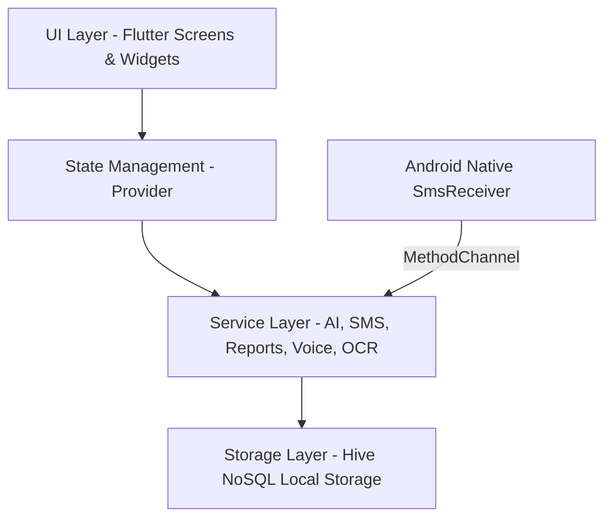

# 💰 Pocketify - Smart Expense Tracker

[](https://flutter.dev)
[](https://dart.dev)
[](https://docs.hivedb.dev/)
[](https://pub.dev/packages/provider)
[](#)
[](LICENSE)

**Pocketify** is an advanced, privacy-first, offline-ready smart expense tracker built with **Flutter**, **Hive**, and **Provider**. Designed to provide total financial visibility and control, Pocketify automatically captures financial SMS notifications, categorizes transactions using smart heuristics, provides AI-driven financial advisories, tracks budgets and savings goals, and generates formatted PDF/CSV financial statements—all while keeping your data 100% private and on your device.

---

## 📋 Table of Contents

- [✨ Key Features](#-key-features)
  - [📊 Smart Dashboard & Analytics](#-smart-dashboard--analytics)
  - [🤖 AI-Powered Financial Insights Engine](#-ai-powered-financial-insights-engine)
  - [📲 Automatic SMS Transaction Capture (Android Native)](#-automatic-sms-transaction-capture-android-native)
  - [💡 Smart Categorizer & Machine Heuristics](#-smart-categorizer--machine-heuristics)
  - [🎙️ Voice Input & OCR Receipt Scanning](#️-voice-input--ocr-receipt-scanning)
  - [💡 Category Budget Capping & Overspend Alerts](#-category-budget-capping--overspend-alerts)
  - [🎯 Savings Goals & Milestone Tracker](#-savings-goals--milestone-tracker)
  - [📑 PDF & CSV Statement Generation](#-pdf--csv-statement-generation)
  - [🛡️ Privacy-First Architecture & Security](#-privacy-first-architecture--security)
  - [🎨 Personalization, Dynamic Themes & Multi-Currency](#-personalization-dynamic-themes--multi-currency)
- [🛠️ Tech Stack & Architecture](#️-tech-stack--architecture)
- [📁 Project Folder Structure](#-project-folder-structure)
- [🗄️ Domain Models & Data Schema](#️-domain-models--data-schema)
- [🚀 Getting Started & Installation](#-getting-started--installation)
- [📱 Native Android SMS Integration Setup](#-native-android-sms-integration-setup)
- [📦 Production Build & Release](#-production-build--release)
- [🧪 Testing & Code Quality](#-testing--code-quality)
- [🔧 Troubleshooting & FAQ](#-troubleshooting--faq)
- [🗺️ Future Roadmap](#️-future-roadmap)
- [📄 License & Contributing](#-license--contributing)

---

## ✨ Key Features

### 📊 Smart Dashboard & Analytics
- **Real-Time Financial Summary**: Instant visibility into total net balance, monthly income, monthly expenses, and net savings.
- **Interactive Visualizations**: High-performance interactive charts powered by `fl_chart`, including spending timeline graphs, income vs. expense comparisons, and category distribution pie charts.
- **Calendar Spending View**: Interactive calendar mode to review day-by-day financial logs and track spending spikes.
- **Recent Transactions & Quick Actions**: Easy access to recent transaction logs with instant search, filter, and quick addition capabilities.

### 🤖 AI-Powered Financial Insights Engine
- **Automated Health Scores**: Computes a dynamic financial health score based on debt, savings ratio, and spending trends.
- **Anomaly & Spike Detection**: Identifies unexpected spending spikes and warns users before financial strain occurs.
- **Predictive Budget Alerts**: Proactively alerts users when spending trends indicate budget limits will be breached before the month ends.
- **Personalized Savings Recommendations**: Generates tailored actionable recommendations based on income-to-expense ratios.

### 📲 Automatic SMS Transaction Capture (Android Native)
- **Zero-Touch Expense Logging**: Intercepts bank and UPI SMS alerts in real-time via a custom Android `MethodChannel` (`com.pocketify.expensetracker/sms`).
- **Comprehensive Bank & UPI Support**: Parses transactional SMS notifications from major institutions (HDFC, SBI, ICICI, Axis, PNB, Kotak, Paytm, PhonePe, Google Pay, CRED, etc.).
- **Smart Entity Extraction**: Automatically extracts transaction amount, type (Debit/Credit), merchant/payee name, date, card/account number last 4 digits, and payment mode.
- **Spam & OTP Filtering**: Advanced multi-tier filter blocks promotional messages, OTPs, balance inquiries, and non-transactional alerts.

### 💡 Smart Categorizer & Machine Heuristics
- **Automatic Category Assignment**: Intelligent keyword matching assigns transactions to pre-defined categories (e.g., Food & Dining, Shopping, Bills & Utilities, Transportation, Entertainment, Health).
- **Customizable Rules**: Smart heuristics adjust over time based on user adjustments and manual overrides.

### 🎙️ Voice Input & OCR Receipt Scanning
- **Voice Transaction Logger**: Dictate expenses on the go with hands-free speech-to-text processing (`voice_service.dart`).
- **OCR Receipt Scanner**: Extract vendor, total amount, and line items directly from camera snapshots or gallery images (`ocr_service.dart`).

### 💡 Category Budget Capping & Overspend Alerts
- **Monthly Spending Caps**: Set strict monthly budget limits per category (e.g., $300/month for Dining).
- **Visual Progress Indicators**: Color-coded progress bars (Green, Yellow, Red) reflect real-time budget utilization.
- **Over-Budget Warnings**: Local push notifications (`flutter_local_notifications`) notify users when reaching 80%, 90%, or 100% of budgeted limits.

### 🎯 Savings Goals & Milestone Tracker
- **Target Creation**: Define savings targets for emergency funds, vacations, new gadgets, vehicles, or home down payments.
- **Contribution Tracking**: Log regular contributions and track current progress percentages against target deadlines.
- **Milestone Celebrations**: Visual badges and celebration triggers upon completing goals.

### 📑 PDF & CSV Statement Generation
- **Professional PDF Reports**: Export monthly and annual financial statements with custom date ranges, branded headers, category summaries, and chart snapshots (`pdf`, `printing`).
- **CSV Data Export**: Export full transaction ledgers in CSV format compatible with Microsoft Excel, Google Sheets, or tax filing tools (`csv`).

### 🛡️ Privacy-First Architecture & Security
- **100% Local NoSQL Storage**: All financial records, profiles, and settings are saved locally using **Hive**. Zero data leaves your device.
- **PIN Lock Authentication**: Secure the application with a 4-digit PIN lock screen (`auth_provider.dart`, `pin_lock_screen.dart`).
- **Multi-Profile Support**: Support for multi-tenant local user profiles (`user_profile_model.dart`).

### 🎨 Personalization, Dynamic Themes & Multi-Currency
- **Dark & Light Themes**: Sleek dark theme designed with glassmorphism and modern colors, alongside an accessible light mode (`theme_currency_provider.dart`).
- **Multi-Currency Support**: Switch between global currency symbols (`₹`, `$`, `€`, `£`, `¥`, `A$`, `C$`, etc.) with instant formatting updates.
- **Custom Categories**: Create, edit, and personalize transaction categories with custom icons and color pickers.

---

## 🛠️ Tech Stack & Architecture



| Component | Technology | Description |
| :--- | :--- | :--- |
| **Framework** | [Flutter 3.10+](https://flutter.dev) | Cross-platform UI toolkit |
| **Language** | [Dart 3.0+](https://dart.dev) | Strongly typed Dart programming language |
| **State Management** | [Provider 6.1.2](https://pub.dev/packages/provider) | Dependency injection and reactive state propagation |
| **Local Persistence** | [Hive 2.2.3](https://pub.dev/packages/hive) & `hive_flutter` | Lightweight, fast key-value NoSQL database engine |
| **Data Visualization** | [fl_chart 0.69.0](https://pub.dev/packages/fl_chart) | Animated line, bar, and pie charts |
| **Document Exporting** | [pdf 3.10.8](https://pub.dev/packages/pdf), [printing](https://pub.dev/packages/printing), [csv](https://pub.dev/packages/csv) | Formatted PDF statement rendering and CSV output |
| **Native Interop** | Kotlin `MethodChannel` | Platform channel for Android SMS broadcast receiver |
| **Notifications** | [flutter_local_notifications 17.1.2](https://pub.dev/packages/flutter_local_notifications) | Local push notification alerts |
| **Media & Fonts** | [google_fonts](https://pub.dev/packages/google_fonts), [image_picker](https://pub.dev/packages/image_picker) | Typography and receipt image selection |

---

## 📁 Project Folder Structure

```text
expense_tracker/
├── android/                        # Native Android project configuration & SmsReceiver implementation
├── ios/                            # Native iOS project configuration
├── assets/                         # Static assets (App icons, illustrations, fallback images)
│   └── images/
├── lib/
│   ├── main.dart                   # Application entry point, Hive initialization, Provider tree setup
│   ├── models/                     # Hive TypeAdapter data models
│   │   ├── transaction_model.dart  # Transaction model (amount, type, category, date, payment method)
│   │   ├── category_model.dart     # Category model (name, icon, color, income/expense flag)
│   │   ├── budget_model.dart       # Budget cap model (category ID, spending limit, period)
│   │   ├── savings_goal_model.dart # Savings target model (title, target, current amount, deadline)
│   │   └── user_profile_model.dart # Local user profile model (name, email, pin, preferences)
│   ├── providers/                  # Application state management logic
│   │   ├── auth_provider.dart      # User authentication and PIN lock state
│   │   ├── transaction_provider.dart# Transaction CRUD, filtering, search, and calculations
│   │   ├── category_provider.dart  # Custom category management state
│   │   ├── budget_provider.dart    # Budget tracking, progress computation, overspend checks
│   │   ├── savings_provider.dart   # Savings goal progress and contribution logging
│   │   └── theme_currency_provider.dart # Dynamic theme toggling & currency selection state
│   ├── services/                   # Business logic services
│   │   ├── ai_insight_service.dart # Financial health, anomaly detection, AI recommendations
│   │   ├── sms_parser_service.dart # Regex engine for bank SMS entity extraction
│   │   ├── sms_auto_capture_service.dart # Service bridging native SMS calls to transaction logs
│   │   ├── smart_categorizer_service.dart # Keyword/heuristic auto-categorization engine
│   │   ├── report_service.dart     # PDF statement generation service
│   │   ├── monthly_report_service.dart # Monthly financial metrics aggregator
│   │   ├── local_storage_service.dart # Hive database open/close and CRUD helper wrapper
│   │   ├── voice_service.dart      # Voice input recognition wrapper
│   │   └── ocr_service.dart        # Image text extraction wrapper for receipts
│   ├── screens/                    # UI Application Screens
│   │   ├── analytics/              # Deep-dive analytics, interactive charts (`analytics_screen.dart`)
│   │   ├── authentication/         # Login & PIN lock screen (`login_screen.dart`, `pin_lock_screen.dart`)
│   │   ├── budget/                 # Budget management & add budget screen (`budget_screen.dart`)
│   │   ├── calendar/               # Calendar view screen (`calendar_screen.dart`)
│   │   ├── categories/             # Category manager screen (`category_screen.dart`)
│   │   ├── dashboard/              # Main navigation & summary screen (`dashboard_screen.dart`)
│   │   ├── expense_income/         # Add/Edit transaction form (`add_edit_transaction_screen.dart`)
│   │   ├── profile/                # Profile management & settings (`profile_screen.dart`)
│   │   ├── reports/                # Statement preview & exporter (`reports_screen.dart`)
│   │   ├── savings/                # Savings goals tracker (`savings_screen.dart`)
│   │   └── splash/                 # Animated startup splash screen (`splash_screen.dart`)
│   ├── utils/                      # Utilities, theme tokens, constants, date formatters
│   │   ├── app_theme.dart          # Dark/Light theme data definitions & palette
│   │   └── formatters.dart         # Currency, date, and percentage formatting helpers
│   └── widgets/                    # Reusable UI Components
│       ├── ai_insight_card.dart    # AI insight widget card
│       ├── balance_summary_card.dart # Header balance overview card
│       ├── credit_card_summary_widget.dart # Credit card style balance banner
│       ├── monthly_budget_card.dart# Budget progress bar tile
│       ├── transaction_notification.dart # Toast/Snackbar notification helper
│       └── transaction_tile.dart   # Standard transaction list item
└── pubspec.yaml                    # Dependencies, assets, and launcher icon configuration
```

---

## 🗄️ Domain Models & Data Schema

Hive HiveFields and Adapters manage the local NoSQL schema:

### 1. `TransactionModel` (`TypeId: 0`)
| Field | Type | Description |
| :--- | :--- | :--- |
| `id` | `String` | Unique transaction ID (UUID/Timestamp) |
| `title` | `String` | Transaction summary / Merchant name |
| `amount` | `double` | Transaction monetary value |
| `date` | `DateTime` | Date and time of transaction |
| `type` | `TransactionType` | Enum (`income`, `expense`) |
| `category` | `String` | Category name or ID |
| `paymentMethod`| `String` | Payment mode (UPI, Credit Card, Cash, Bank Transfer) |
| `notes` | `String?` | Optional user description or note |
| `isAutoCaptured`|`bool` | True if auto-captured from bank SMS |

### 2. `BudgetModel` (`TypeId: 1`)
| Field | Type | Description |
| :--- | :--- | :--- |
| `id` | `String` | Unique budget identifier |
| `categoryId` | `String` | Category identifier budget applies to |
| `amountLimit` | `double` | Maximum budget threshold per month |
| `startDate` | `DateTime` | Budget tracking start period |

### 3. `SavingsGoalModel` (`TypeId: 2`)
| Field | Type | Description |
| :--- | :--- | :--- |
| `id` | `String` | Unique goal identifier |
| `title` | `String` | Name of goal (e.g., Vacation Fund) |
| `targetAmount` | `double` | Total target savings amount |
| `currentAmount`| `double` | Saved amount accumulated to date |
| `targetDate` | `DateTime` | Deadline target completion date |
| `category` | `String` | Associated savings category |

### 4. `CategoryModel` (`TypeId: 3`) & `UserProfileModel` (`TypeId: 4`)
- `CategoryModel`: Maps icon code points, ARGB color codes, category labels, and type flags.
- `UserProfileModel`: Manages local authentication credentials, security PIN hashes, user name, profile picture path, and preferred currency symbol.

---

## 🚀 Getting Started & Installation

### Prerequisites
Before running the application, ensure your environment meets the following requirements:
- **Flutter SDK**: `>= 3.10.0` ([Download Flutter](https://docs.flutter.dev/get-started/install))
- **Dart SDK**: `>= 3.0.0`
- **Android SDK & Build Tools**: JDK 17, Android API level 33+ (for native SMS permission handling)
- **IDE**: Android Studio / VS Code with Flutter and Dart extensions installed

### Installation Steps

1. **Clone the repository**
   ```bash
   git clone https://github.com/your-username/expense_tracker.git
   cd expense_tracker
   ```

2. **Install Flutter dependencies**
   ```bash
   flutter pub get
   ```

3. **Generate Hive Adapters (If modifying models)**
   ```bash
   flutter pub run build_runner build --delete-conflicting-outputs
   ```

4. **Run the Application**
   - Connect a physical Android/iOS device or start an emulator, then execute:
   ```bash
   flutter run
   ```

---

## 📱 Native Android SMS Integration Setup

To enable real-time SMS transaction auto-capture on Android physical devices:

1. **Permissions in `AndroidManifest.xml`**:
   The app requests `RECEIVE_SMS` and `READ_SMS` permissions. Ensure the following entries are present in `android/app/src/main/AndroidManifest.xml`:
   ```xml
   <uses-permission android:name="android.permission.RECEIVE_SMS" />
   <uses-permission android:name="android.permission.READ_SMS" />
   <uses-permission android:name="android.permission.POST_NOTIFICATIONS" />
   ```

2. **Runtime Permission Approval**:
   When prompted on first app execution, tap **Allow** for SMS permission prompts.

3. **Battery Optimization Exclusion**:
   On devices running aggressive battery saver profiles (e.g., Xiaomi MIUI, Samsung OneUI, OnePlus OxygenOS), grant Pocketify background autostart permissions so `SmsReceiver` fires reliably when the app is minimized.

---

## 📦 Production Build & Release

### Build Android Release APK
```bash
flutter build apk --release
```
The output file will be generated at:
`build/app/outputs/flutter-apk/app-release.apk`

### Build Android App Bundle (AAB for Google Play Store)
```bash
flutter build appbundle --release
```
The output file will be generated at:
`build/app/outputs/bundle/release/app-release.aab`

### Build iOS Release App
```bash
flutter build ios --release
```

### Build Web Version
```bash
flutter build web --release
```

---

## 🧪 Testing & Code Quality

Execute the test suite and static code analyzer to ensure stability:

```bash
# Run all unit and widget tests
flutter test

# Run static code analysis and lint checking
flutter analyze
```

---

## 🔧 Troubleshooting & FAQ

<details>
<summary><b>1. Missing Hive Adapters / Build Runner Errors</b></summary>
<br>
If you encounter errors like <code>HiveError: Cannot find adapter for type...</code>, regenerate Hive adapters by running:
<pre><code>flutter pub run build_runner build --delete-conflicting-outputs</code></pre>
</details>

<details>
<summary><b>2. SMS Auto-Capture is not triggering on Android Emulator</b></summary>
<br>
SMS auto-capture requires real SMS broadcasts. To test on Android Emulator:
<ol>
  <li>Open Emulator extended controls (<code>...</code> button).</li>
  <li>Navigate to <b>Phone</b> menu -> <b>SMS message</b> tab.</li>
  <li>Send a sample message such as: <i>"Rs 450.00 debited from a/c XX1234 on 28-JUL-26 at STARBUCKS via UPI."</i></li>
</ol>
</details>

<details>
<summary><b>3. PDF Export fails on Web</b></summary>
<br>
File system saving differs on Web browsers. Pocketify automatically uses browser blob downloads when running on web builds.
</details>

---

## 🗺️ Future Roadmap

- [ ] **Cloud Encrypted Backup**: Optional user-controlled Google Drive & iCloud sync for cross-device backup.
- [ ] **Account Aggregator API**: Direct bank balance sync via open banking protocols.
- [ ] **Multi-Currency Auto Conversion**: Live exchange rate updates for multi-currency transactions.
- [ ] **WearOS & WatchOS Companion**: Quick expense logging widget for smartwatches.

---

## 📄 License & Contributing

Distributed under the **MIT License**. See `LICENSE` for more information.

### Contributing
Contributions are welcome! Follow these steps to contribute:
1. Fork the Project.
2. Create your Feature Branch (`git checkout -b feature/AmazingFeature`).
3. Commit your Changes (`git commit -m 'Add some AmazingFeature'`).
4. Push to the Branch (`git checkout push origin feature/AmazingFeature`).
5. Open a Pull Request.

---

<p align="center">
  Built with ❤️ using <b>Flutter</b> and <b>Dart</b>
</p>
